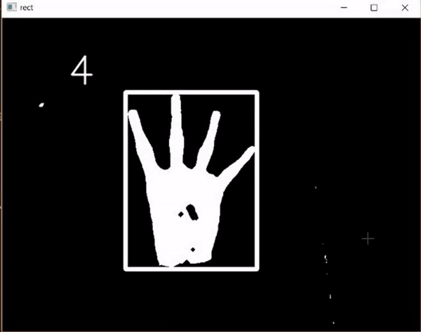

# Gesture-Recognition-using-machine-learning
 The project was carried out as a part of Summer Internship At CDSAML, PES UNIVERSITY 2017.

## Working
<ul type=1>
 <li>SVM</li> 
<p>A Support Vector Machine (SVM) is a supervised machine learning algorithm that can be employed for both classification and regression purposes.
But in this case it is used for classification purpose. SVMs are based on the idea of finding a hyperplane that best divides a dataset into multiple clases. The SVM model was trained using hand digit image dataset which was manually generated and processed, the dataset consists of 5 classes totally and each class consists of approximately ~20 images which was processed and resized into 25x25 dimensional image.<br/>
 RGB values of the hand were used to detect hand in the frame, once the hand was detected contours were construted on the detected region to get the dimensions of the detected region so that the actual region can be extracted from the frame, once the region was extracted, the region of image was converted to binary after applying a threashold and then the entire region was raveled so that it becomes a single vector to be fed into the SVM model. The SVM model predicts the label for the input vector. The below gif gives a sample of the SVM models' ouput.
 
 
 </p>
</ul>

## Usage
To clone this repository.
```
$git clone https://github.com/SKsaqlain/Gesture-Recognition-using-machine-learning GRUML
```
Cd to  the Directory
```
$cd GRUML
```

## Requirements
<ul type=1>
    <li>Python 3.6.5</li>
    <li>OpenCV 3</li>
    <li>Tensorflow 1.8.0 CPU support only</li> 
 <ul>
    
